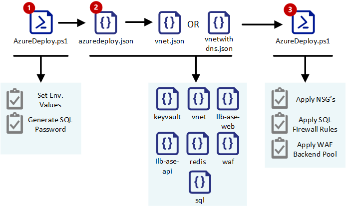

# **(Private Preview)** NIST 800-66 Reference PaaS Blueprint with ASE

## Contents

- [1. Solution Overview](#1-solution-overview)
	- [1.1 NIST 800-66 Based Assurance Framework Azure PaaS](#11-nist-800-66-based-assurance-framework-for-azure-blueprint-deployment)
- [2. Solution Design and Deployed Resources](#2-soution-design-and-deployed-resources)
	- [2.1 Architecture](#21-architecture)
	- [2.2 Deployed Azure Resources](#22-deployed-azure-resources)
	- [2.3 Security](#23-security)
		- [Virtual Network](#virtualnetwork)
		- [Application Gateway w/ WAF](#waf---application-gateway)
		- [Redis Cache](#rediscache)
		- [ILB ASE w/ Web Apps](#ilb-ase-w/-web-apps)
		- [ILB ASE w/ Api Apps](#ilb-ase-w/-api-apps)
		- [Azure SQL](#azuresql)
		- [Azure KeyVault](#azure-keyvault)
- [3. NIST 800-66 Assurance - Security Compliance Matrix](#3-nist-800-66-security-matrix-compliance)
- [4. Deployment Guide](#4-deployment-guide) 
	- [4.1 Installation Prerequisites](#41-installation-prerequisites)
	- [4.2 Template Deployment Sequence](#42-template-deployment-sequence)
	- [4.3 Deployment Steps](#43-deployment-steps)
	- [4.4 Clone the Solution](#44-clone-the-solution)
	- [4.5 Configure azuredeploy.parameters.json](#45-onfigure-azuredeployparametersjson)
	- [4.6 Configure azuredeploy.ps1](#46-configure-azuredeployps1)
	- [4.7 Run azuredeploy.ps1](#47-run-azuredeployps1)
	- [4.8 Expected Output](#48-expected-output)
- [5. Cost](#5-cost)

## 1. Solution Overview



This Blueprint deploys a fully automated secure baseline Azure ARM Template + PowerShell solution to provision a highly secure, orchestrated and configured Platform as a Service environment mapped to a NIST 800-66 assurance security controls matrix, that includes :

+ Azure App Service Environment with an ILB, App Service Environment & Web App
+ Azure App Service Environment with an ILB, App Service Environment & API App
+ Redis Cache Cluster
+ Web Application Gateway with WAF in Prevention Mode
+ Azure SQL 
+ Azure KeyVault

The environment is locked down using Network Security Groups on each subnet with restricted access between all provisioned Azure services and also between subnets, as described in the [security](#s23-security) section below.

### 1.1 NIST 800-66 Based Assurance Framework for Azure PaaS Blueprint
Lorem epsum.

## 2. Solution Design and Deployed Resources

### 2.1 Architecture
This diagram displays an overview of the solution


### 2.2 Deployed Azure Resources

#### 2.2.1 Virtual Network
##### Microsoft.Networks
+ **/virtualNetworks**: 1 Virtual Network and 4 Subnets
+ **/publicIPAddresses**: 1 Public IP Address for Application Gateway WAF

#### 2.2.2 Application Gateway - WAF
##### Microsoft.Networks
+ **/applicationGateway**: 1 Application Gateway

#### 2.2.3 Redis Cache
##### Microsoft.Cache
+ **Redis**: Redis Cache Cluster

#### 2.2.4 ILB ASE - Web App
##### Microsoft.Web
+ **/hostingEnvironments**: Deploys App Service Environment v1
+ **/serverFarms**: Deploys a default App Service Plan
+ **kind: "webapp"**: Deploys a default Azure WebApp

#### 2.2.5 ILB ASE - API App
##### Microsoft.Web
+ **/hostingEnvironments**: Deploys App Service Environment v1
+ **/serverFarms**: Deploys a default App Service Plan
+ **kind: "apiapp"**: Deploys a default Azure WebApp

#### 2.2.6 Azure SQL
##### Microsoft.Sql
+ **/servers**: Deploys an Azure SQL Server
+ **/servers/databases**: Deploys an Azure SQL Database
+ **/servers/firewallRules**: Applied Firewall rule for Outbound IP's from both ASE's

#### 2.2.7 Azure KeyVault
##### Microsoft.KeyVault
+ **/vaults**: Deploys a new Keyvault with a secret for Azure SQL

### 2.3 Security

+ The solution locks down all subnets with a top-level DenyAll with a weight of 100 by default
+ Generates a secure pasword for Azure SQL and stores it as a secret in Azure KeyVault
+ Applies Firewall Roles to lock down incoming traffic to Azure SQL only from provisioned ASE Outbound IP addresses
+ Configures Backend Pools for the Application Gateway to communicate only on Ports 80 and 443 for the ASE ILB IP addresses
+ Blocks all FTP/FTPS 'deployment' access to ASE environments
+ Restricts Azure Redis Cache communication only with the ASE Subnets
+ Turns off non-SSL endpoints for Azure Redis Cache
+ Deploys Application Gateway with WAF turned on in prevention mode with OWASP rulest 3.0

#### Virtual Network

#### WAF - Application Gateway

#### ILB ASE w/ Web Apps

#### ILB ASE w/ Api Apps

#### Redis Cache

#### Azure SQL

#### KeyVault

#### Passwords & Secrets

## NIST 800-66 Assurance Security Compliance Matrix

 Security Control| Azure Configuration | Responsibility
  ---|---|---
Control 1 | Mapping | Azure
Control 2 | Mapping | Customer 

## 4. Deployment Guide

### 4.1 Installation Prerequisites

This solution utilizes a combination of ARM templates and PowerShell. In order to deploy the solution, you must have the following packages installed correctly and in working order on your local machine

+ [Install and configure](https://github.com/PowerShell/PowerShell) the latest version of PowerShell
+ [Install and configure](https://technet.microsoft.com/en-us/library/dn975125.aspx#Anchor_1) Windows Azure Active Directory Module for Windows PowerShell - Implement Step-1 only
_Please Note: The blueprint code does **not** use [Azure Active Directory V2 PowerShell module](https://technet.microsoft.com/en-us/library/dn975125.aspx#Anchor_5)_
+ [Install](https://docs.microsoft.com/en-us/powershell/azure/install-azurerm-ps?) Azure Resource Manager PowerShell Module

### 4.2 Deployment Steps
> **Please Note**: At this time, this blueprint cannot be deployed using just the ARM template (azuredeploy.json). The solution must be deployed by executing the AzureDeploy.ps1 locally. 

1. Clone the solution on your local machine
2. Navigate to azuredeploy.parameters.json on your local machine and fill in all parameter values for your deployment as defined in the [Configuration Values](#) section
3. Update the User Defined values in the AzureDeploy.ps1
4. Execute AzureDeploy.ps1
5. Grab a coffee and wait for deployment to finish. Deployment time can take anywhere between 1-2 hours.

### 4.3 Template Deployment Sequence


### 4.4 Clone the Solution

+ Clone the blueprint to your local machine

``` Batchfile
git clone https://github.com/mayurshintre/Blueprints-PaaS-ASE.git somefolder
``` 
+ or download as a ZIP from https://github.com/mayurshintre/Blueprints-PaaS-ASE

### 4.5 Configure _azuredeploy.parameters.json_

Please update the following values in the _azuredeploy.parameters.json_ file on your local machine. This file holds all configuration and sizing parameters for all services deployed in this Blueprint. Please follow the instructions carefully as any typo's can result in a failed deployment.

  Resource | Parameter | Default Value| Allowed Values | Configuration
  ---|---|---|---|---|
  All | All | - | **No spaces or special characters. Lower case alphabets and numbers only.** | Adding special characters will break deployment for Azure SQL.
  All | SystemPrefixName | _blueprint_ | lowercase string and numbers, upto 8 characters | Prefix name for the entire solution. Prepended to all resource names. Keep it short (4-6 characters). Lower case alphabets and numbers only. No spaces or special characters.
  Vnet | vnetAddressPrefix | _10.0.0.0_ | Network Space Only | As defined within [RFC 1918 Range](https://tools.ietf.org/html/rfc1918)
  Vnet | vnetAddressPrefixCIDR | _/16_ | CIDR Block | As defined within [RFC 1918 Range](https://tools.ietf.org/html/rfc1918)
  Subnet | WAFSubnetPrefix | _10.0.0.0_ | Within the defined Vnet space | As defined within [RFC 1918 Range](https://tools.ietf.org/html/rfc1918)
  Subnet | WAFSubnetPrefixCIDR | _/24_ | As defined within [RFC 1918 Range](https://tools.ietf.org/html/rfc1918)

### 4.6 Configure _azuredeploy.ps1_ PowerShell File

Only update the following user defined inputs section in the _azuredeploy.ps1_ file

``` PowerShell
##Azure Region to Deploy all resources including the Resource Group
$Region = "West US"

##Name of the Resource Group to deploy
$RgName = "demo"
	
##Name to give the Deployment that will be ran
$DeploymentName = $RgName +"nist800ase"

##Location of the main azuredeploy.json template
$TemplateUri = "https://raw.githubusercontent.com/mayurshintre/Blueprints/master/ase-ilb-blueprint/azuredeploy.json"

##Location of the local parameters file
$ParameterFile = "Repository Location\azureDeploy.parameters.json"
    
##Subscription ID that will be used to host the resource group
$SubscriptionID = "Your Subscription ID here"
```
### 4.7 Run _azuredeploy.ps1_

``` PowerShell
Windows PowerShell
Copyright (C)Microsoft Corporation. All rights reserved.

PS C:\User>azuredeploy.ps1

```

### 4.8 Expected Output


### 4.9 Optional - Post Deployment UDR

If you plan to terminate a VPN connection or On-premises ExpressRoute to this ASE Vnet **and turn on forced tunnelling**, you will require all the subnets to have User Defined Routes to traverse all internet facing traffic direcly out of the Vnet. This is required for proper functioning of the ASE environments as specified in the [ASE ExpressRoute network requirements article](https://docs.microsoft.com/en-us/azure/app-service-web/app-service-app-service-environment-network-configuration-expressroute#enabling-outbound-network-connectivity-for-an-app-service-environment)

The UDR.ps1 script can be run after a successful deployment to apply these default UDR's to all subnets to bypass forced tunneling to on-premises network.

You will require to fill in the following values inside the UDR.ps1 powershell.

``` PowerShell
## Resource Group Name of the deployed Blueprint environment
$ResourceGroup = "RG Name Here"
## Location of the Resource Group of the deployed Blueprint environment
$location = "Location Here"
## Name of the User Defined Route. Can be left at default.
$UDRName = "ASEInternetOutbound"
## Name of the VNET in which the Bluepring ASE is deployed
$ExistingVnetName = "VNet name here"
## Do not rename this variable.
$routeName = "RouteToInternet"
```

## 5. Modifying the Templates

You can modify the ARM templates directly by following the ARM json syntax. By and large, there should be no need to modify the ARM templates except for the _azuredeploy.parameters.json_ which holds all configuration parameters for all Azure services deployed in the Blueprint

You may need to modify the _azuredeploy.json_ template or any other individual resource templates under the /tempaltes folder if you wish to modify values hardcoded as variables in _azuredeploy.json_ or individual resource templates not available by desigh as parameters in the _azuredeploy.parameters.json_ template. 

+ For example, if may need to change the Redis Cache configuration to enable non-SSL ports, you can navigate to the azuredelploy.json template and modify the following parameters in the json code block below 
+ Some values are intentionally hardcoded as variables in _azuredeploy.json_ in order to prevent the end user from modifying those values, to meet the NIST 800-66 security controls, and in other cases, such as the redis cache _max_ values, because they are widely accepted as defaults and do not need end user configuration.

>**Please Note: By changing any security related hard-coded variables in _azuredeploy.json_ or any other individual resource teplates, you will break the NIST 800-66 secure baseline compliance assurance provided in the [NIST 800-66 Security Compliance Matrix](#nist-800-66-security-compliance-matrix) section** and the obligation to meet the security control will be transferred on to you, the end user.

``` json
    "enableNonSSLPort": false,

    "redisCachemaxclients": 7500,
    "redisCachemaxmemoryreserved": 200,
    "redisCachemaxfragmentationmemory-reserved": 300,
    "redisCachemaxmemory-delta": 200,
```
_Excerpt from azuredeploy.json for hard-coded redis cache variables not exposed in azuredeploy.parameters.json file_

## 6. Cost

You are entirely responsible for the cost of the Azure services used while running this NIST 800-66 reference PaaS deployment template for ASE. There is no additional cost for using this template. The Azure Resource Manager template for this NIST 800-66 reference PaaS deployment for ASE includes configuration parameters that you can customize. Some of these settings will affect the cost of deployment. For cost estimates, see the pricing pages for each AWS service you will be using or the [Azure Calculator](https://azure.microsoft.com/en-us/pricing/calculator/) or the [Azure Channel Pricing Calculator](https://azure.microsoft.com/en-us/pricing/calculator/) if you are an enterprise customer with an ELA. Prices are subject to change.

## Authors

+ Dustin Paulson, Premier Field Engineer, Microsoft
+ Jerad Berhow, Premier Field Engineer, Microsoft
+ Mayur Shintre, Principal Architect, Microsoft

`Tags: [Microsoft, Azure, NIST, 800-66, Compliance, ARM, Templates, PaaS, ASE]`